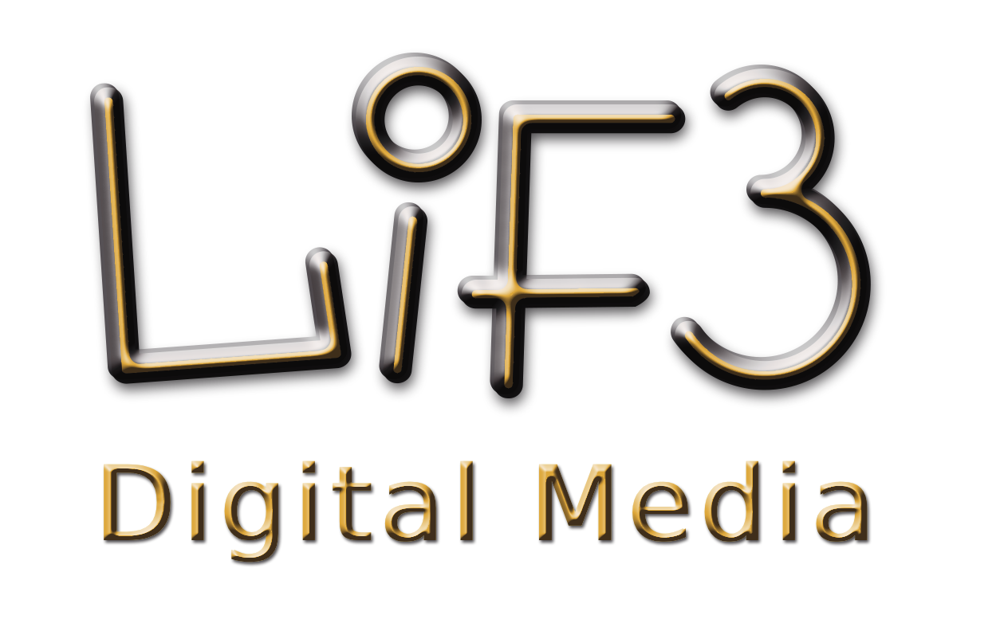

# Olá, eu sou o Anderson Chiesa 👋

Desenvolvedor e Analista de Processos focado em **Automação Inteligente (RPA)**, **Inteligência Artificial** e **Eficiência Operacional**. Traduzo desafios complexos de negócios e fluxos manuais em sistemas escaláveis, performáticos e de alta conversão.

Como fundador da **Lif3 digital media**, conecto engenharia de software com estratégias digitais avançadas para criar ferramentas que geram impacto real.

---

## 🚀 No que estou focado atualmente:

* 🤖 **Process Automation & RPA:** Construção de fluxos de trabalho autônomos integrando Python, n8n e Google Apps Script para otimizar ecossistemas operacionais e logísticos.
* 📈 **Data Visualization:** Criação de dashboards de performance e indicadores em Looker Studio, Excel avançado e Google Sheets.
* 💻 **Web Development:** Interfaces modernas, minimalistas (Apple-style) e interativas utilizando React, Tailwind CSS e GSAP, com deploy na Vercel e Netlify.
* 🧠 **AI-Driven Tools:** Engenharia de prompt aplicada, assistentes virtuais automatizados e ferramentas de apoio para infoprodutos e atração de audiência.

---

## 🛠️ Tecnologias e Ferramentas:

| Categoria | Stack |
| :--- | :--- |
| **Linguagens & Back-end** | Python, Google Apps Script, Node.js |
| **Front-end & Design** | React, Tailwind CSS, GSAP, HTML5, CSS3, JavaScript |
| **Automação & Cloud** | n8n, GitHub, Vercel, Netlify |
| **Dados & Analytics** | Looker Studio, Google Sheets, Microsoft Excel (KPIs/Dashboards) |

---

## 📊 Projetos em Destaque:

* **[Simulador de Carrossel Premium]** - Aplicação web interativa estilo Apple para criação, edição ao vivo e exportação de carrosséis em PDF em alta resolução nativa para o LinkedIn.
* **[Indica+]** - Sistema dinâmico de indicação e rastreamento para controle e gestão de bonificações contratuais.
* **[Esteira de Infoprodutos Lif3]** - Estrutura otimizada de páginas de vendas focadas em alta conversão e interfaces dinâmicas para o mercado de infoprodutos (Hotmart).

---

## 📬 Vamos nos conectar?

* **LinkedIn:** [andersonchiesa](https://www.linkedin.com/in/achiesa12/) _(Substitua pelo seu link real)_
* **E-mail:** lif3digitaledia@gmail.com
* **Website:** [lif3digital.com](https://www.lif3digital.com.br)

  

